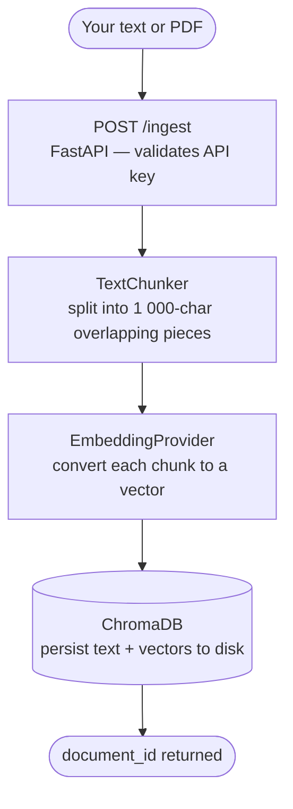
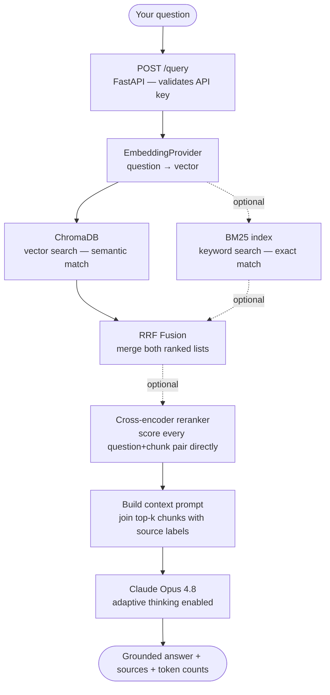
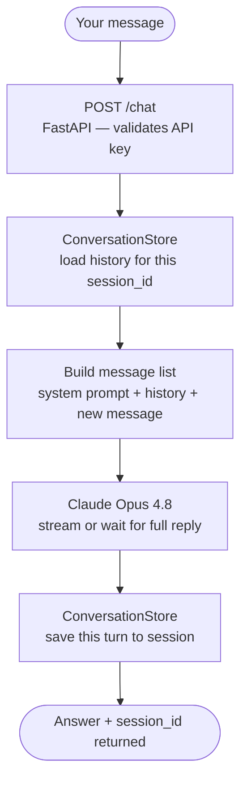

# llmframe

> Production-grade RAG + multi-LLM framework — hybrid search, streaming, cross-encoder reranking, and a REST API. Built with Python, FastAPI, Claude, and ChromaDB.


**Live demo → `<!-- ADD YOUR URL HERE AFTER DEPLOY -->`**

---

## The problem with basic RAG

Most RAG implementations use vector search only. Vector search works well for *semantic* similarity but fails on:

- **Exact keywords** — "GPT-4o" or "GDPR Article 22" won't match if embeddings drift
- **Rare terms** — product codes, names, IDs, abbreviations
- **Short factual queries** — "what is the version number" matches poorly by cosine distance

This framework solves that with a three-stage retrieval pipeline:

```
Query
  │
  ├─► Vector search  (semantic similarity via ChromaDB)
  ├─► BM25 search    (keyword matching)
  │       │
  │   RRF merge      (Reciprocal Rank Fusion — best of both lists)
  │       │
  └─► Cross-encoder rerank  (scores every candidate pair directly)
          │
        Top-k chunks → Claude Opus 4.8 → Grounded answer
```

---

## Features

| | Feature | Detail |
|--|---------|--------|
| 🔀 | **Multi-LLM** | Claude Opus 4.8 (primary) + GPT-4o — swap with one line |
| 🔍 | **Hybrid search** | BM25 + vector similarity, fused with Reciprocal Rank Fusion |
| 🎯 | **Cross-encoder reranking** | Re-scores every (query, chunk) pair for higher precision |
| 🧠 | **Adaptive thinking** | Claude reasons before answering on complex queries |
| ⚡ | **Streaming** | Server-Sent Events — tokens appear as they are generated |
| 💬 | **Conversation memory** | Per-session history, auto-trimmed to fit context window |
| 📄 | **File ingestion** | PDF and TXT upload via REST endpoint |
| 🔌 | **Dual embeddings** | OpenAI API or local sentence-transformers (no cost, no network) |
| 🔑 | **API key auth** | `X-API-Key` header auth on all endpoints |
| 🐳 | **Docker** | `docker compose up` — one command deploy |

---

## How it works

### Ingest — storing a document



> **Why overlapping chunks?** If a sentence spans a split boundary, both neighbours share it — so no meaning is lost at the edge.

---

### Query — answering a question



> **Dashed arrows** = optional stages, toggled by `HYBRID_SEARCH_ENABLED` and `RERANKER_ENABLED` in `.env`.  
> **Why two retrieval methods?** Vector search finds semantically similar text. BM25 finds exact keywords. Together they cover cases either one misses.

---

### Chat — multi-turn conversation



> **No session_id on first call?** The server creates one and returns it. Pass it back on every follow-up message so Claude sees the full conversation.

---

## Quickstart

### 1 — Install

```bash
git clone https://github.com/YOUR_USERNAME/llmframe
cd llmframe
pip install -e ".[all]"
```

### 2 — Configure

```bash
cp .env.example .env
```

Edit `.env` and add your keys:

```env
ANTHROPIC_API_KEY=sk-ant-...
OPENAI_API_KEY=sk-...
API_SECRET_KEY=choose-a-secret
```

### 3 — Run

```bash
# Local dev server
uvicorn src.llmframe.api.app:app --reload

# Or with Docker
docker compose up
```

Open **http://localhost:8000/docs** for the interactive Swagger UI.

---

## Usage

### Python library

```python
import asyncio
from src.llmframe import FrameworkConfig, AnthropicProvider, RAGPipeline

async def main():
    config = FrameworkConfig.from_env()
    llm    = AnthropicProvider(api_key=config.anthropic_api_key)
    rag    = RAGPipeline(llm=llm, config=config)

    # Store a document
    doc = await rag.ingest(
        "The EU AI Act classifies AI systems by risk level: unacceptable, high, limited, and minimal.",
        source="eu-ai-act-summary.txt"
    )

    # Ask a question
    result = await rag.query("What risk levels does the EU AI Act define?")
    print(result.answer)

asyncio.run(main())
```

**Example output:**
```
The EU AI Act defines four risk levels:
1. Unacceptable risk — prohibited systems (e.g. social scoring)
2. High risk — subject to strict requirements (e.g. biometric systems)
3. Limited risk — transparency obligations apply
4. Minimal risk — no obligations (e.g. spam filters)

Source: eu-ai-act-summary.txt
```

### Streaming

```python
async for token in llm.stream([Message(role="user", content="Explain vector embeddings.")]):
    print(token, end="", flush=True)
```

### Swap Claude for GPT-4o

```python
from src.llmframe import OpenAIProvider

llm = OpenAIProvider(api_key=config.openai_api_key)
rag = RAGPipeline(llm=llm, config=config)   # everything else unchanged
```

### Ingest a PDF

```python
doc = await rag.ingest_file("research-paper.pdf")
result = await rag.query("What were the key findings?")
```

### Enable hybrid search + reranking

```env
# .env
HYBRID_SEARCH_ENABLED=true
RERANKER_ENABLED=true
```

No code changes needed — the pipeline picks up the config automatically.

---

## REST API

### Ingest a document

```bash
curl -X POST http://localhost:8000/ingest \
  -H "Content-Type: application/json" \
  -H "X-API-Key: $API_SECRET_KEY" \
  -d '{"content": "Your document text...", "source": "my-doc.txt"}'
```

```json
{ "document_id": "3f7a...", "source": "my-doc.txt", "status": "stored" }
```

### Query

```bash
curl -X POST http://localhost:8000/query \
  -H "Content-Type: application/json" \
  -H "X-API-Key: $API_SECRET_KEY" \
  -d '{"question": "What does the document say about X?"}'
```

```json
{
  "answer": "According to the document...",
  "query": "What does the document say about X?",
  "model": "claude-opus-4-8",
  "provider": "anthropic",
  "input_tokens": 892,
  "output_tokens": 134,
  "sources": [
    { "score": 0.94, "rank": 0, "chunk": { "content": "...", "metadata": { "source": "my-doc.txt" } } }
  ]
}
```

### Chat (multi-turn with session memory)

```bash
# First message — server creates a session
curl -X POST http://localhost:8000/chat \
  -H "Content-Type: application/json" \
  -H "X-API-Key: $API_SECRET_KEY" \
  -d '{"messages": [{"role": "user", "content": "What is RAG?"}]}'

# Follow-up — pass the session_id to continue the conversation
curl -X POST http://localhost:8000/chat \
  -H "Content-Type: application/json" \
  -H "X-API-Key: $API_SECRET_KEY" \
  -d '{"messages": [{"role": "user", "content": "Give me an example."}], "session_id": "abc-123"}'
```

### Upload a file

```bash
curl -X POST http://localhost:8000/ingest/file \
  -H "X-API-Key: $API_SECRET_KEY" \
  -F "file=@document.pdf"
```

### Full endpoint reference

| Method | Endpoint | Auth | Description |
|--------|----------|:----:|-------------|
| `GET` | `/health` | — | Liveness check |
| `POST` | `/chat` | ✓ | LLM chat. Add `"stream": true` for SSE. |
| `GET` | `/sessions/{id}` | ✓ | Get conversation history |
| `DELETE` | `/sessions/{id}` | ✓ | Clear a session |
| `POST` | `/ingest` | ✓ | Ingest text |
| `POST` | `/ingest/file` | ✓ | Upload PDF or TXT |
| `POST` | `/query` | ✓ | RAG query — retrieve + generate |
| `DELETE` | `/documents/{id}` | ✓ | Remove a document |

Interactive docs: **http://localhost:8000/docs**

---

## Configuration

| Variable | Default | Description |
|----------|---------|-------------|
| `ANTHROPIC_API_KEY` | — | Claude API key **(required)** |
| `OPENAI_API_KEY` | — | OpenAI key (required unless `EMBEDDING_PROVIDER=local`) |
| `API_SECRET_KEY` | `` | Auth key — leave empty to disable (local dev only) |
| `DEFAULT_MODEL` | `claude-opus-4-8` | LLM model |
| `EMBEDDING_PROVIDER` | `openai` | `openai` or `local` (sentence-transformers, no cost) |
| `EMBEDDING_MODEL` | `text-embedding-3-small` | Embedding model |
| `HYBRID_SEARCH_ENABLED` | `false` | Enable BM25 + vector + RRF fusion |
| `RERANKER_ENABLED` | `false` | Enable cross-encoder reranking |
| `RERANKER_MODEL` | `cross-encoder/ms-marco-MiniLM-L-6-v2` | Reranker model |
| `CHUNK_SIZE` | `1000` | Max characters per chunk |
| `CHUNK_OVERLAP` | `200` | Overlap between adjacent chunks |
| `MAX_RETRIEVED_CHUNKS` | `5` | Chunks returned per query |
| `CHROMA_PERSIST_DIR` | `./data/chroma` | ChromaDB storage path |
| `LOG_LEVEL` | `INFO` | `DEBUG` / `INFO` / `WARNING` |

---

## Project structure

```
llmframe/
├── src/llmframe/
│   ├── core/
│   │   ├── types.py            # Pydantic models (Message, Document, RAGResponse …)
│   │   ├── config.py           # Env-driven config — all settings in one place
│   │   └── logging.py          # Rotating file logger, noisy-library silencing
│   ├── providers/
│   │   ├── base.py             # BaseLLMProvider — swap any LLM without touching RAG
│   │   ├── anthropic_provider.py   # Claude Opus 4.8 + adaptive thinking + streaming
│   │   └── openai_provider.py      # GPT-4o
│   ├── rag/
│   │   ├── chunking.py         # Recursive splitter: paragraph → sentence → word → char
│   │   ├── embeddings.py       # OpenAI or local embeddings + factory function
│   │   ├── vectorstore.py      # ChromaDB abstraction (BaseVectorStore for easy swap)
│   │   ├── pipeline.py         # Orchestrates all RAG stages — the main engine
│   │   ├── hybrid_search.py    # BM25Index + Reciprocal Rank Fusion
│   │   └── reranker.py         # CrossEncoder reranker
│   ├── memory/
│   │   └── conversation.py     # Per-session history, auto-trimmed to context limit
│   └── api/
│       └── app.py              # FastAPI — auth, streaming SSE, all endpoints
├── examples/
│   ├── basic_rag.py            # 30-line end-to-end demo
│   ├── multi_provider.py       # Claude vs GPT-4o side-by-side
│   └── streaming_chat.py       # Real-time streaming demo
├── tests/
│   ├── test_chunker.py         # 9 unit tests — pure, no mocks
│   ├── test_pipeline.py        # 8 async tests — mocked LLM + store
│   └── test_api.py             # 8 integration tests — auth, sessions, endpoints
├── Dockerfile
├── docker-compose.yml
└── pyproject.toml
```

---

## Tests

```bash
pip install -e ".[dev]"
pytest tests/ -v
```

25 tests, all green. No API keys required — all external calls are mocked.

---

## Architecture decisions

**Why hybrid search?**
Pure vector search ranks by cosine similarity between dense embeddings. It handles paraphrases well but misses exact-match queries — product codes, names, specific version numbers. BM25 handles those. RRF fusion combines both ranked lists without requiring calibrated scores.

**Why a cross-encoder reranker?**
Bi-encoders (used for vector search) embed query and document independently — fast but approximate. A cross-encoder sees both together and scores them jointly, which is significantly more accurate. The tradeoff is speed, so we use it only on the top candidates already retrieved.

**Why `BaseLLMProvider` as an abstract class?**
Decouples the RAG pipeline from any specific LLM. Switching from Claude to GPT-4o (or a local Ollama model) requires adding one class and changing one env var. The pipeline, retrieval, and API layer change nothing.

**Why ChromaDB for local dev?**
Zero infrastructure. Data persists on disk. For production, `BaseVectorStore` makes it a one-file swap to Pinecone or pgvector.

---

## License

MIT — use it, modify it, build on it.
